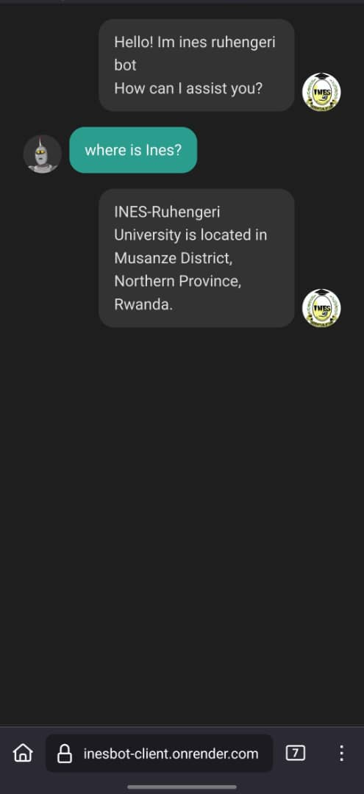

# 🤖 INES Chatbot Backend (Flask + MongoDB)

This project is the backend API service for the **INES-Ruhengeri University chatbot**, powered by **Flask**, **MongoDB**, a It handles message storage per user session (room)

---

## Try it here 👇
[https://inesbot-client.onrender.com/](https://inesbot-client.onrender.com/)

---


## 📦 Features
- 🌐 CORS enabled for frontend communication, is open api just use it
- 💾 MongoDB database integration
---

## 🚀 Getting Started

### 1️⃣ Clone the repository

```bash
git clone https://github.com/zakk-io/inesBot-api.git
cd inesBot-api
```


### 2️⃣ Create and activate a virtual environment

```bash
python -m venv venv

venv\Scripts\activate
```

### 3️⃣ Install dependencies

```bash
pip install -r requirements.txt
```


### 4️⃣ Set up your environment variables
```bash
MONGO_URI=mongodb+srv://<username>:<password>@cluster.mongodb.net/?retryWrites=true&w=majority
```